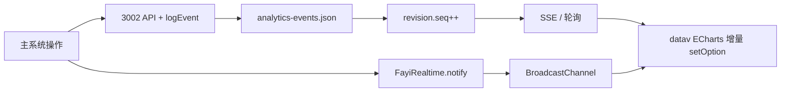

# 法绎 AI 法律平台 — 管理端 / 数字大屏 / 动效模块说明

## 架构图

```
waitlist-html/
├── profile.html              # 个人中心 + 嵌入管理端
├── law-education.html        # 普法宣传
├── datav/                    # 数字大屏（/datav/index.html）
├── css/
│   ├── fayi-motion.css       # 全站动效
│   ├── modules/admin.css     # 管理端嵌入样式
│   └── law-education.css
├── js/
│   ├── auth.js               # 导航 + 数字大屏入口 + 动效启动
│   ├── fayi-motion.js        # 页面淡入淡出切换
│   └── modules/
│       ├── admin/
│       │   ├── admin-api.js
│       │   └── admin-panel.js
│       └── datav/
│           └── realtime-store.js   # 跨页实时刷新桥
│   datav/js/datav.js               # 大屏主逻辑
└── server/
    └── modules/
        ├── admin/            # /api/admin/*
        └── law-education/    # /api/law-education/*
```

## 管理端（基于个人中心扩展）

- **入口**：`profile.html` 侧栏「进入管理端」（`GET /api/admin/auth/check-email` 校验管理员邮箱）
- **鉴权**：独立 `fayi_admin_token`，`POST /api/admin/auth/login`
- **默认账号**：`admin@fayi.local` / `admin123`
- **模块**：总览、用户、咨询、文书、OCR、普法、法规库、系统日志
- **图表**：ECharts 5（CDN）

## 数字大屏（实时联动驾驶舱）

- **入口**：顶栏「数字大屏」→ `datav/index.html`（跳转前写入 `sessionStorage.datav-return`）
- **退出**：右上角「退出大屏」/「返回主页」；快捷键 **ESC**（全屏时 ESC 先退出全屏）
- **全屏**：`Fullscreen API`，按钮文案随状态切换

### 启动 3002（大屏数据前置条件）

数字大屏**必须**先启动多模态后端（端口 3002），否则无法拉取实时统计。

```bash
cd waitlist-html
npm run server:3002
```

Windows 也可双击：`scripts/start-3002.bat`

健康检查：`GET http://localhost:3002/api/admin/datav/health`

### 真实数据分析（`analytics-engine.js`）

- 事件写入时自动：**关键词提取**、**案件分类**、**风险等级**、**用户地域**（按 userId 稳定映射省份）
- 大屏聚合：`categories`、`risks`、`keywords`、`topQuestions`、`regions`（来自真实事件，无固定 mock 数组）
- 客户端缓存：`js/modules/datav/realtimeDataStore.js`（localStorage 快照，3002 离线时可展示上次数据）

### 数据同步机制

| 层级 | 说明 |
|------|------|
| 后端埋点 | `multimodal-server.js` 在 `/api/chat`、`/api/ocr`、`/api/process-image`、`/api/wenshi/generate`、`/api/fagui/search`、`/api/process-case` 等成功后写入 `admin-store` 事件 |
| 版本号 | `data-revision.json` 的 `seq`，每次 `logEvent` / OCR / 文书记录变更时递增 |
| 拉取 | `GET /api/admin/datav/realtime`（`Cache-Control: no-store`） |
| 推送 | `GET /api/admin/datav/stream`（SSE，2s；有变更发 `update`，否则 `ping`） |
| 前端桥 | `js/modules/datav/realtime-store.js` → `FayiRealtime.notify()` + `BroadcastChannel` |
| 大屏刷新 | `datav/js/datav.js`：SSE 优先 + 2s 轮询兜底；`visibilitychange` 立即拉取；跨标签 `BroadcastChannel` |

### 数据流（简图）



### 图表更新

- 首次 `setOption` 全量；后续 `lazyUpdate + silent` 局部合并，避免整图闪烁
- 核心指标数字使用 `requestAnimationFrame` 滚动动画

### 新增/主要文件

- `js/modules/datav/realtime-store.js`
- `datav/js/datav.js`、`datav/index.html`、`datav/css/datav.css`
- `server/modules/admin/admin-store.js`（`buildRealtimePayload`、`bumpDataRevision`）
- `server/modules/admin/index.js`（`/datav/realtime`、`/datav/stream`、`/datav/bump`）

## 全站动效

| 效果 | 实现 |
|------|------|
| 页面切换 | `fayi-motion.js` → opacity + translateY，0.48s cubic-bezier |
| 导航 hover | `fayi-motion.css` |
| 卡片上浮 | transform + box-shadow |
| 骨架屏 | `.fayi-skeleton` + shimmer |

## 数据表（JSON）

| 逻辑表 | 路径 |
|--------|------|
| admins | server/data/admin/admins.json |
| analytics-events | server/data/admin/analytics-events.json |
| law_articles | server/data/law-education/law_articles.json |

## 兼容性

- 原有 `/api/auth`、`/api/chat`、`/api/wenshi`、`/api/fagui`、OCR 等**未改路径**
- 仅**新增** `/api/admin/*`、`/api/law-education/*`
- 用户 `users.json` 结构不变
